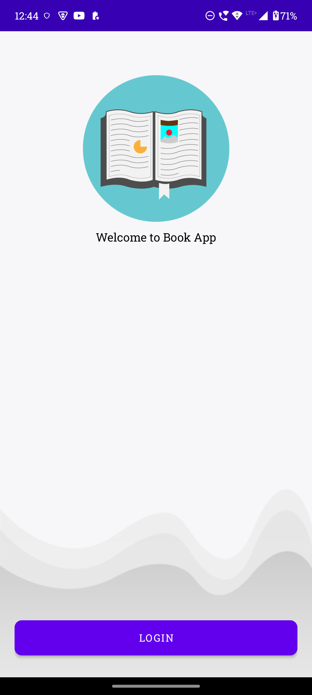
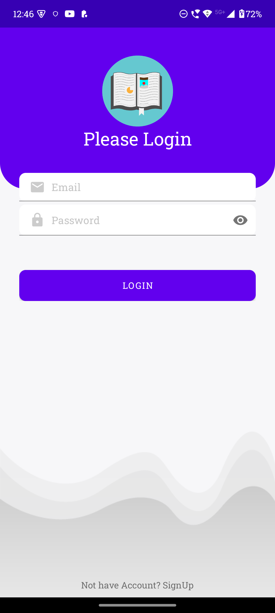
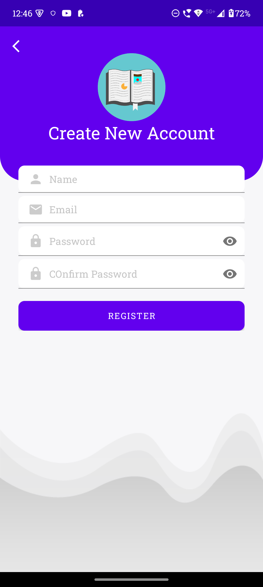
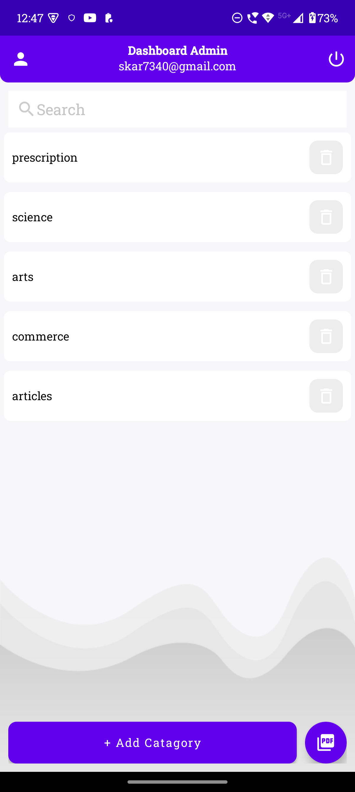
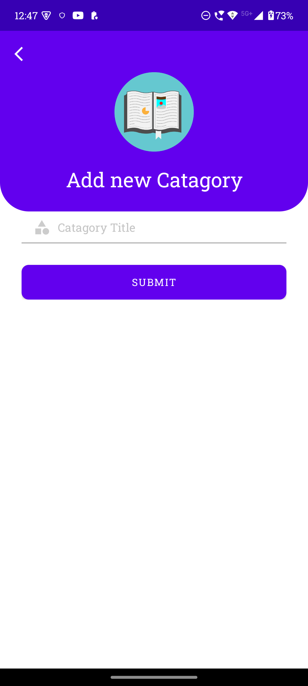
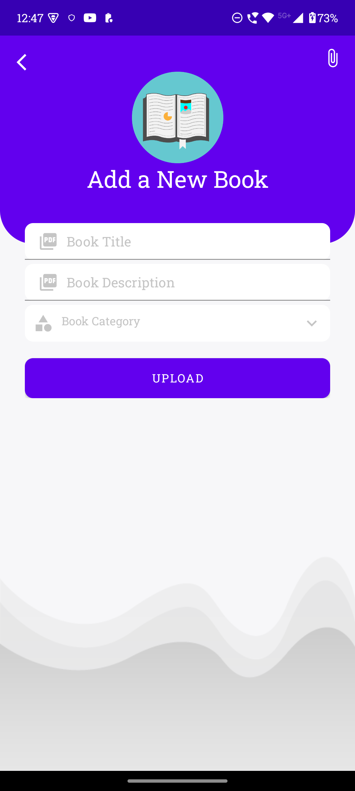
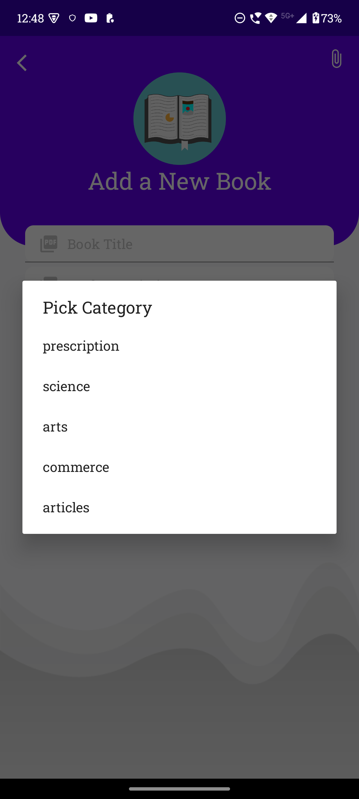
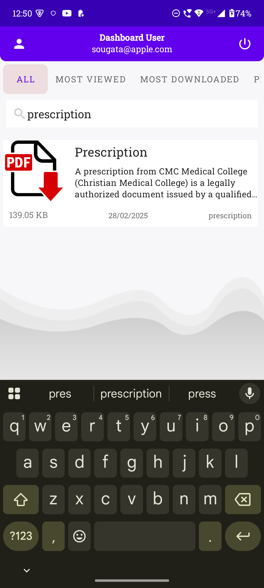
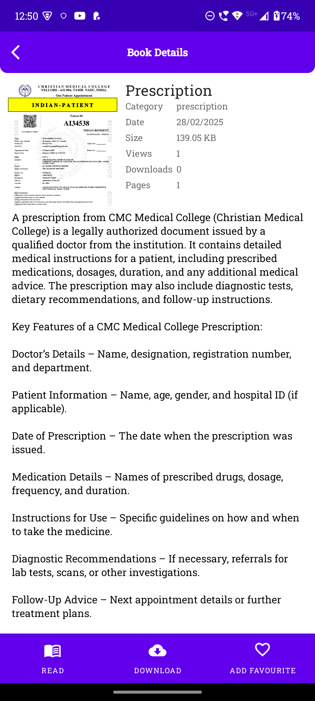
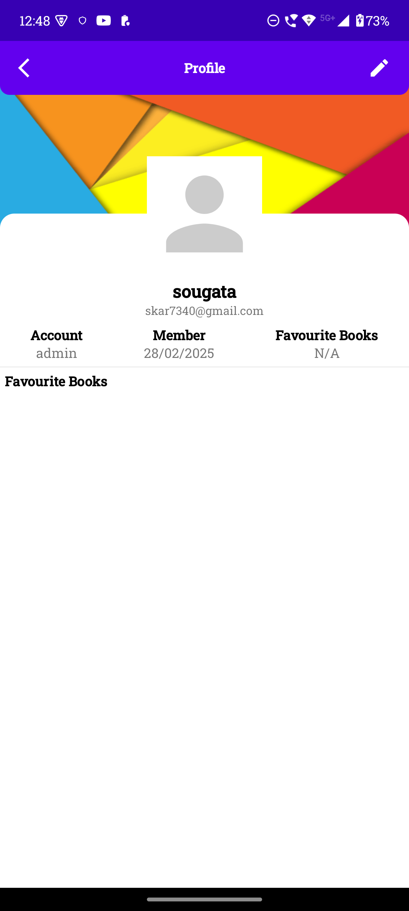

# 📚 Book Management App

A simple Android application for managing book categories and uploading books in PDF format.  
The app has two user roles: **Admin** and **Users**.

---

## 🚀 Features

### 🧑‍💼 **Admin Features**
- Login with Admin credentials
- Manage book categories (Add/Delete)
- Upload books in PDF format with descriptions
- Logout functionality

### 📖 **User Features**
- Register and Login with email and password
- Search books by title or category
- View book details
- Download books in PDF format
- View and manage user profile

---

## 🔑 **Admin Credentials**
- **Email:** `skar7340@gmail.com`
- **Password:** `sougata2002`

Login with these credentials to access admin features.

---

## 📸 **Screenshots**

### 🌿 **Intro Screen**
- This is the first screen users see. It welcomes them to the app with a clean interface and a **Login** button.  
  

---

### 🔐 **Login & Register Screens**
- Users can log in using their email and password.
- New users can register by providing their email and password.  
  
  

---

### 🧑‍💼 **Admin Home Screen**
- Admins can view the list of book categories.
- There is an option to add new categories using the **Add Category** button.
- Admins can also upload PDF books using the **Upload PDF** button.  
  

---

### ➕ **Add Category Screen**
- Admins can add new book categories using this screen.
- Simply enter the category name and click **Add**.  
  

---

### 📤 **Upload PDF Screen**
- Admins can upload book PDFs using this screen.
- Choose the relevant category, add a book title and description, and upload the file.  
  

---

### 📚 **Choose Category Screen**
- While uploading books, admins can select from previously created categories using a dropdown.  
  

---

### 🏷️ **Search Book Screen**
- Users can search for books by title or browse books by categories.
- The search functionality provides accurate and quick results.  
  

---

### 📖 **View Book Screen**
- Users can view the book details including the title, author, description, and the option to download the PDF.  
  

---

### 🧑 **Profile Screen**
- Users can manage their personal information on the profile page.
- Options to edit the username, email, or password may also be available.  
  

---

## 🛠 **Installation and Setup**

1. **Clone the Repository**
    ```bash
    git clone https://github.com/your-username/your-repo-name.git
    ```
2. **Open in Android Studio**
3. **Add google services.json file**
4. **Run the App on Emulator/Device**

---

## 📝 **License**
This project is licensed under the MIT License - see the [LICENSE](LICENSE) file for details.

---

## ⭐ **Support**
If you like this project, please consider giving it a ⭐ on GitHub!  
For any issues or feedback, feel free to create a [new issue](https://github.com/your-username/your-repo-name/issues).  
